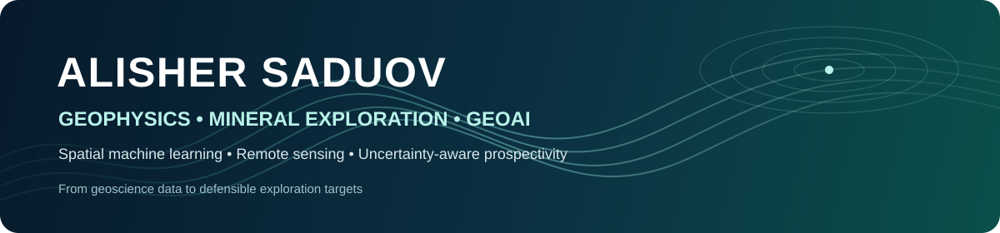

  

  
  
  

## About

I am a **geophysicist and GeoAI researcher** working at the intersection of mineral exploration, potential-field geophysics, remote sensing and spatial machine learning. I hold a **PhD in Petroleum and Ore Geophysics** and work at **Satbayev University, Kazakhstan**.

My research focuses on turning heterogeneous geoscience data into exploration decisions that remain defensible under spatial dependence, incomplete labels and geological uncertainty. I am particularly interested in **mineral prospectivity mapping, positive-unlabeled learning, spatially independent validation, applicability-domain control, uncertainty quantification and multimodal geodata integration**.

I work with gravity, magnetics, radiometrics, borehole logs, remote-sensing products, geology and structural information, combining domain knowledge with reproducible Python workflows.

> **Research principle:** a high model score is not enough. Exploration models should be spatially honest, geologically interpretable, uncertainty-aware and useful for target ranking.

## Featured GeoAI projects

<table>
<tr>
<td width="50%" valign="top">

### 🟨 [Nevada Au-Ag GeoAI Prospectivity](https://github.com/Kazinage/nevada-au-ag-geoai-prospectivity)

**Flagship supervised prospectivity workflow**

Spatial GroupKFold, train-test exclusion buffers, positive-unlabeled learning, Area of Applicability, calibrated Random Forest, uncertainty and decision-focused top-k targeting.

**Published result:** the highest-ranked 10% of supported area captured **84.2% of Au** and **85.6% of Ag** pooled out-of-fold positives.

[Paper](https://doi.org/10.3390/min16090886) · [Code](https://github.com/Kazinage/nevada-au-ag-geoai-prospectivity)

</td>
<td width="50%" valign="top">

### 🟧 [Zambia Cu-Co Unsupervised Prospectivity](https://github.com/Kazinage/zambia-cu-co-unsupervised-prospectivity)

**Label-scarce airborne geophysics**

Gravity, magnetics and radiometrics integrated through K-Means, Fuzzy C-Means, Self-Organizing Maps and consensus clustering.

The workflow converts multivariate geophysical similarity into a continuous FCM prospectivity score while keeping geological follow-up explicit.

[Paper](https://doi.org/10.55452/1998-6688-2026-23-2-435-450) · [Code](https://github.com/Kazinage/zambia-cu-co-unsupervised-prospectivity)

</td>
</tr>
<tr>
<td width="50%" valign="top">

### 🟩 [Uranium Horizon ML Geophysics](https://github.com/Kazinage/uranium-horizon-ml-geophysics)

**Well-log ML with leakage-aware validation**

Random Forest classification of lithology and productive uranium horizons using gamma ray, resistivity, spontaneous potential and engineered gamma attributes.

Validation is grouped by **well_id**, so neighbouring depth samples from the same borehole cannot leak across train and test folds.

[Code](https://github.com/Kazinage/uranium-horizon-ml-geophysics)

</td>
<td width="50%" valign="top">

### 🟦 [Mineral Anomaly Detection ML](https://github.com/Kazinage/mineral-anomaly-detection-ml)

**Unsupervised rare-mineral detection**

PCA, Isolation Forest, One-Class SVM, a transparent 2σ statistical benchmark and K-Means clustering for high-dimensional mineralogical data.

The associated study analysed **3,112 minerals** and approximately **140 physical and chemical attributes**.

[Paper](https://doi.org/10.1016/j.acags.2025.100250) · [Code](https://github.com/Kazinage/mineral-anomaly-detection-ml)

</td>
</tr>
</table>

## Research areas

`Mineral Prospectivity Mapping` · `Exploration Geophysics` · `GeoAI` · `Spatial Machine Learning` · `Remote Sensing` · `Gravity & Magnetics` · `Borehole Geophysics` · `Positive-Unlabeled Learning` · `Uncertainty Quantification` · `Spatial Validation`

## Technical stack

**GeoAI and ML**  
Python · pandas · NumPy · SciPy · scikit-learn · PyTorch · TensorFlow · LightGBM · CatBoost · imbalanced-learn · SHAP

**Geoscience and GIS**  
Oasis montaj · ArcGIS · QGIS · Surfer · Petrel · Techlog · TemisFlow 2D · GemPy · raster/vector geoprocessing · well-log processing

**Research workflow**  
Spatial cross-validation · model calibration · uncertainty analysis · reproducible pipelines · geophysical transforms · multimodal data integration · scientific visualization

## Selected research

- **Saduov et al. (2026)** - *AOA-Constrained, Calibrated Random-Forest Prospectivity Mapping for Au-Ag in Nevada Great Basin: Spatially Independent Validation, Uncertainty, and Decision-Focused Top-k Targets.* **Minerals 16(9), 886.** [DOI](https://doi.org/10.3390/min16090886)
- **Saduov (2026)** - *Unsupervised Delineation of Prospectivity Zones for Stratiform Cu-Co in the Southern Copperbelt Margin (Zambia).* **Herald of the Kazakh-British Technical University 23(2), 435-450.** [DOI](https://doi.org/10.55452/1998-6688-2026-23-2-435-450)
- **Sharapatov, Saduov et al. (2025)** - *Prediction of rare and anomalous minerals using anomaly detection and machine learning techniques.* **Applied Computing and Geosciences 26, 100250.** [DOI](https://doi.org/10.1016/j.acags.2025.100250)

## Current direction

My current work is moving toward **uncertainty-aware multimodal GeoAI for critical-mineral exploration**: integrating potential fields, remote sensing, geology, structures and other spatial evidence while explicitly controlling extrapolation, incomplete labels and spatial validation.

The goal is not only to produce a prospectivity map, but to answer three operational questions:

**Where should exploration focus? · How reliable is the ranking? · Where is the model extrapolating beyond its evidence?**

## Collaboration

I am interested in international **postdoctoral research, research scientist / GeoAI roles, mineral-exploration R&D, collaborative projects and technically substantive consulting** where geoscience knowledge and machine learning are both central to the problem.

  <b>Geophysics + geological reasoning + spatial ML + uncertainty</b> 
  Almaty, Kazakhstan · Open to international research and R&D collaboration

